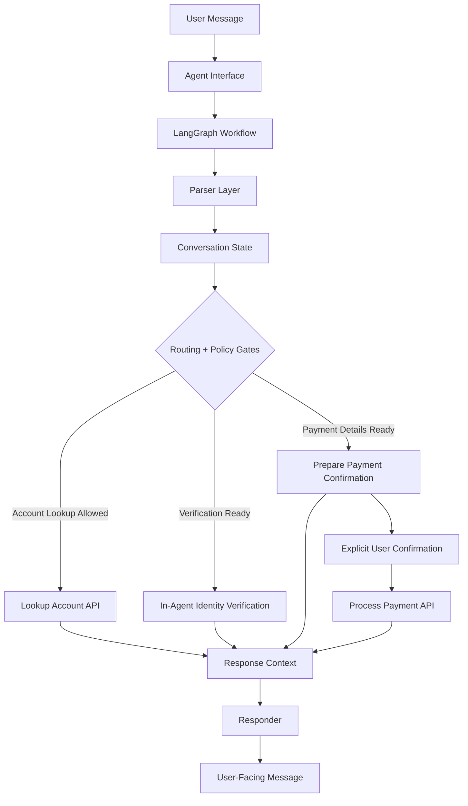

# SettleSentry: Payment Collection Agent


SettleSentry is a policy-governed conversational payment collection agent that verifies identity, reveals outstanding balance only after verification, collects payment details, and processes payments through a controlled API workflow.

The core design principle is strict separation of concerns:

- LLM usage is optional and bounded to language understanding and response phrasing.
- Workflow progression is controlled by LangGraph orchestration.
- Payment safety is enforced by deterministic policy gates.
- Payment API calls happen only after verification, validated payment details, and explicit confirmation.

## Why This Project Exists

Payment collection is a high-risk conversational workflow. The agent must maintain multi-turn context, avoid premature tool calls, handle partial and out-of-order user input, enforce strict identity verification, recover safely from API failures, and protect sensitive identity and payment data.

A free-form chatbot alone is not sufficient for this problem. SettleSentry separates language understanding from payment authority: the LLM may help interpret or phrase messages, but it does not verify identity, authorize payment, decide balance disclosure, or call payment APIs directly.


## Core Capabilities

- Multi-turn conversation state management
- Account lookup using the provided external API
- Strict identity verification using exact full name and one matching secondary factor
- Balance disclosure only after successful verification
- Payment amount and card detail collection
- Explicit confirmation gate before payment processing
- Policy-gated payment execution
- Retry handling for verification and payment flows
- Safe terminal closure for ambiguous service failures
- Optional LLM parser and optional LLM responder with deterministic fallback
- Evaluation-compatible Agent interface

## Business Value

SettleSentry demonstrates how an AI payment agent can support collection workflows without giving uncontrolled authority to the LLM.

The design improves:

- **Customer experience:** clear step-by-step guidance through verification and payment
- **Operational efficiency:** automated handling of repetitive account lookup and payment collection flows
- **Risk control:** deterministic gates for verification, balance disclosure, and payment execution
- **Auditability:** explicit workflow states, policy decisions, and structured execution paths
- **Extensibility:** LangGraph-based workflow can support future graph-native tool-calling modes

## Architecture Overview



> Each user message is processed as one controlled workflow turn. The conversation session preserves state across turns, so the agent can handle multi-turn progress without losing account, verification, payment, retry, or closure context.

## Safety Model

SettleSentry uses deterministic safety checks for payment-critical behavior:

* No payment step before successful identity verification
* Strict verification: exact full name plus one exact secondary factor
* DOB, Aadhaar, and pincode are not echoed back to the user
* Outstanding balance is shown only after verification succeeds
* Payment amount is validated before collecting card details
* Payment processing requires explicit user confirmation
* The payment API is called only from the payment processing node
* Terminal payment service failures close safely to avoid ambiguous retries
* Full card number and CVV are cleared from active state after success, terminal failure, cancellation, or closure

## Agent Flow

1. Greet user and request account ID
2. Look up account through the provided API
3. Request full name exactly as registered
4. Request one secondary verification factor
5. Verify identity inside the agent
6. Share outstanding balance after verification
7. Collect payment amount
8. Collect cardholder name, card number, expiry, and CVV
9. Ask for explicit yes/no confirmation
10. Process payment through the API
11. Communicate success with transaction ID or failure with reason
12. Recap and close the conversation

## Modes

The CLI supports three current modes:

| Mode       | Input Understanding                 | Response Writing                       | Use Case                                                                     |
| ---------- | ----------------------------------- | -------------------------------------- | ---------------------------------------------------------------------------- |
| `local`    | Deterministic parser                | Deterministic responses                | Stable baseline with no external LLM dependency                              |
| `llm`      | LLM parser + deterministic fallback | Deterministic responses                | Better extraction from natural language while keeping fixed response wording |
| `full-llm` | LLM parser + deterministic fallback | LLM responder + deterministic fallback | More natural response phrasing with safety fallback                          |

For evaluator-safe runs, use deterministic local mode:

```bash
uv run settlesentry chat --mode local
uv run python scripts/evaluate_agent.py --no-all --mode local
```

The default CLI mode is `llm`. Use `local` when no OpenRouter API key is configured.

In all modes, payment authority remains deterministic and policy-controlled. The LLM does not verify identity, authorize payment, decide balance disclosure, or call payment APIs directly.

> A future extension can add a graph-native tool-calling mode where the LLM proposes actions, while LangGraph and the policy layer validate and execute only approved tool calls.

## Tech Stack

* Python 3.12
* LangGraph for workflow orchestration
* Pydantic and Pydantic Settings for schema and configuration validation
* PydanticAI with OpenRouter for optional LLM parser/responder behavior
* HTTPX and Tenacity for API communication and retry handling
* Typer and Rich for interactive CLI
* Pytest for test coverage
* uv for environment and execution management

## Setup

From the repository root:

```bash
uv sync --all-packages
```

## Environment Variables

LLM configuration is optional and required only for `llm` and `full-llm` modes.

```bash
# Optional, required only for LLM modes
OPENROUTER_API_KEY=...

# Optional LLM tuning
OPENROUTER_ENABLED=true
OPENROUTER_MODEL=openrouter/free
OPENROUTER_TIMEOUT_SECONDS=10
OPENROUTER_TEMPERATURE=0.0
OPENROUTER_MAX_TOKENS=300
OPENROUTER_RETRIES=1

# Optional API configuration
API_BASE_URL=...
API_TIMEOUT_SECONDS=30
API_MAX_RETRIES=2

# Optional agent policy configuration
AGENT_POLICY_VERIFICATION_MAX_ATTEMPTS=3
AGENT_POLICY_PAYMENT_MAX_ATTEMPTS=3
AGENT_POLICY_ALLOW_PARTIAL_PAYMENTS=true
AGENT_POLICY_ALLOW_ZERO_BALANCE_PAYMENT=false
```

## Run Interactive CLI
> If no OpenRouter API key is configured, run the agent in `local` mode
```bash
# Local rule-based mode:
uv run settlesentry chat --mode local

# LLM parser mode:
uv run settlesentry chat --mode llm

# LLM parser and LLM responder mode:
uv run settlesentry chat --mode full-llm

# Show privacy-safe state after each turn:
uv run settlesentry chat --mode local --show-state

# Enable console debug logs:
uv run settlesentry chat --mode local --debug-logs
```

## Run Tests

```bash
uv run pytest -q
```

## Public Interface Contract

The public evaluation interface is `Agent.next(user_input: str) -> dict`.

```python
from settlesentry.agent.interface import Agent

agent = Agent()

response = agent.next("Hi")

assert set(response.keys()) == {"message"}
print(response["message"])
```

Each `Agent.next()` call processes one user turn. The same `Agent` instance maintains conversation state internally across turns.

## Project Structure

```text
settlesentry/
  pyproject.toml
  src/
    settlesentry/
      agent/          # Agent interface, LangGraph workflow, parser, policy, state, responder
      integrations/   # Payment API client and schemas
      security/       # Card and identity validation helpers
      core/           # Settings and logging
      utils/          # Timing utilities
tests/                # Unit and workflow tests
scripts/              # Scenario evaluator and helper scripts
docs/                 # Assignment instructions and supporting documentation
```

## Example Happy Path

```text
USER: Hi
AGENT: Hello, I'm SettleSentry. I help with account verification and payment. Please share your account ID.

USER: ACC1001
AGENT: Account found. Please share your full name exactly as registered on the account.

USER: Nithin Jain
AGENT: Please share your one verification factor: DOB in YYYY-MM-DD format, Aadhaar last 4 digits, or pincode.

USER: 1990-05-14
AGENT: Identity verified. Your outstanding balance is INR 1250.75. Please share the amount you would like to pay in INR.

... payment amount, card details, and confirmation collected ...

USER: yes
AGENT: Payment of INR 500.00 was processed successfully. Transaction ID: txn_.... This conversation is now closed.
```

Full happy-path, failure, retry, side-question, and edge-case examples are documented in [Sample Conversations](docs/SAMPLE_CONVERSATIONS.md).

## Assumptions

* Identity verification is performed inside the agent after account lookup.
* Full name matching is strict and exact.
* At least one secondary factor must match exactly: DOB, Aadhaar last 4, or pincode.
* Partial payments are allowed by default, matching the assignment API notes.
* Zero-balance accounts are closed without collecting payment unless policy configuration changes.
* Terminal service failures are closed safely to avoid ambiguous payment retries.
* The provided payment API does not persist balance updates after successful payment.

## Documentation

* [Design Document](docs/DESIGN.md)
* [Sample Conversations](docs/SAMPLE_CONVERSATIONS.md)
* [Evaluation Approach](docs/EVALUATION.md)
* [Assignment Instructions](docs/instructions/ASSIGNMENT.md)

## Disclaimer

SettleSentry is a technical implementation and reference architecture for a payment collection agent. It is not intended for production payment processing as-is.

The project demonstrates workflow orchestration, identity verification, policy-gated tool use, failure handling, and evaluation design. A production deployment would require additional security review, PCI-DSS controls, secrets management, monitoring, audit logging, human escalation, fraud controls, and compliance validation.

> [!CAUTION]
> Do not use real payment card data with this project. Use only assignment-provided or test payment data.

## License

This project is licensed under the BSD 3-Clause License.

See [LICENSE](LICENSE) for details.
