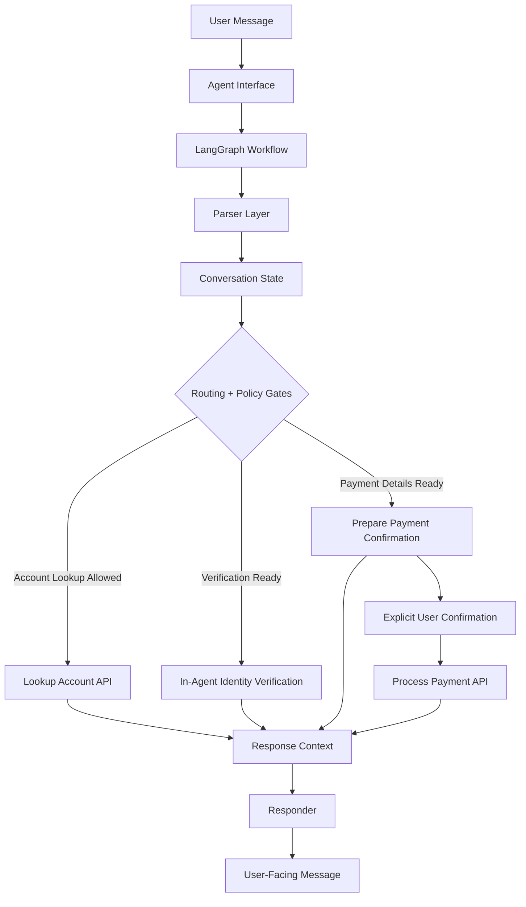

# SettleSentry: Payment Collection Agent


**SettleSentry** is a conversational payment collection agent for services where customers may have an outstanding amount due, such as cloud bills, mobile plans, subscriptions, or other recurring service balances. It verifies the customer first, shows the amount due only after verification, and guides payment collection through a controlled, policy-governed workflow.

The core design principle is separation of language understanding from payment authority:

- LLM usage is optional and limited to parsing and response phrasing.
- LangGraph controls workflow progression.
- Deterministic policy gates control verification, balance disclosure, confirmation, and payment execution.


## Why It Matters

Payment collection is a sensitive workflow. The agent must maintain multi-turn context, avoid premature tool calls, handle partial or out-of-order input, enforce identity verification, recover safely from failures, and protect sensitive identity and payment data.

SettleSentry demonstrates how this workflow can be automated without giving uncontrolled authority to an LLM. Language models can help interpret user input and phrase responses, while verification, balance disclosure, payment authorization, and API execution remain controlled by deterministic workflow and policy logic.

## Core Capabilities

- Multi-turn account verification and payment collection
- Strict identity verification before balance disclosure
- Policy-gated amount validation, card collection, and payment execution
- Explicit confirmation before any payment API call
- Recovery flows for verification, amount, card, API, cancellation, and terminal failure cases
- Optional LLM parser and optional LLM responder with deterministic fallback
- Scenario evaluator covering success, recovery, guardrail, correction, and closure paths
- Evaluation-compatible interface

## Architecture Overview



Each user message is processed as one controlled workflow turn. The session preserves structured workflow state and recent conversation context so the agent can handle short replies, corrections, retries, and out-of-order information without losing control of payment-critical decisions.

For the full architecture, policy model, assumptions, and tradeoffs, see the [Design Document](docs/DESIGN.md).

## Safety Model

SettleSentry keeps payment authority outside the LLM:

* Balance is shown only after successful identity verification.
* Payment amount is validated before card collection.
* Payment processing requires valid payment details and explicit confirmation.
* All payment-critical transitions pass deterministic policy checks.
* Full card number and CVV are cleared after success, terminal failure, cancellation, or closure.
* Out-of-order user input may be remembered, but policy gates still control sensitive actions.

For detailed safety rules and workflow decisions, see [Design Document](docs/DESIGN.md).

## Modes

The CLI supports three modes:

| Mode       | Input Understanding                 | Response Writing                       | Use Case                                                               |
| ---------- | ----------------------------------- | -------------------------------------- | ---------------------------------------------------------------------- |
| `local`    | Deterministic parser                | Deterministic responses                | Stable baseline with no external LLM dependency                        |
| `llm`      | LLM parser + deterministic fallback | Deterministic responses                | Natural-language extraction with fixed response wording                |
| `full-llm` | LLM parser + deterministic fallback | LLM responder + deterministic fallback | Natural-language extraction and response phrasing with safety fallback |

The default CLI mode is `llm`. Use `local` when no OpenRouter API key is configured.

In all modes, payment authority remains deterministic and policy-controlled. The LLM does not verify identity, authorize payment, decide balance disclosure, or call payment APIs directly.

## Tech Stack

* Python 3.12
* LangGraph for workflow orchestration
* Pydantic and Pydantic Settings for schema/configuration validation
* PydanticAI with OpenRouter for optional LLM parser/responder behavior
* HTTPX and Tenacity for API communication and retry handling
* Typer and Rich for interactive CLI
* Pytest for unit and workflow test coverage
* uv for environment and execution management

## Setup

From the repository root:

```bash
uv sync --all-packages
```

## Configuration

LLM configuration is optional and required only for `llm` and `full-llm` modes.

```bash
# Optional, required only for LLM modes
OPENROUTER_API_KEY=...

# Optional LLM tuning
OPENROUTER_ENABLED=true
OPENROUTER_MODEL=openrouter/free
OPENROUTER_TIMEOUT_SECONDS=10
OPENROUTER_TEMPERATURE=0.0
OPENROUTER_MAX_TOKENS=300
OPENROUTER_RETRIES=1

# Optional API configuration
API_BASE_URL=...
API_TIMEOUT_SECONDS=30
API_MAX_RETRIES=2

# Optional agent policy configuration
AGENT_POLICY_VERIFICATION_MAX_ATTEMPTS=3
AGENT_POLICY_PAYMENT_MAX_ATTEMPTS=3
AGENT_POLICY_ALLOW_PARTIAL_PAYMENTS=true
AGENT_POLICY_ALLOW_ZERO_BALANCE_PAYMENT=false
```

## Run the Agent

```bash
# Local deterministic mode
uv run settlesentry chat --mode local

# LLM parser with deterministic responses
uv run settlesentry chat --mode llm

# LLM parser and LLM-written responses
uv run settlesentry chat --mode full-llm

# Show privacy-safe state after each turn
uv run settlesentry chat --mode local --show-state

# Enable console debug logs
uv run settlesentry chat --mode local --debug-logs
```

If no OpenRouter API key is configured, use `local` mode.

## Run Tests and Evaluation

Run the core test suite:

```bash
uv run pytest -q
```

Run the deterministic scenario evaluator:

```bash
uv run python scripts/evaluate_agent.py --no-all --mode local
```

Run LLM-assisted evaluation when credentials are configured:

```bash
uv run python scripts/evaluate_agent.py --no-all --mode llm
uv run python scripts/evaluate_agent.py --no-all --mode full-llm
```

Use `--exhaustive` when you want the selected LLM mode to run the full scenario matrix. Without `--exhaustive`, LLM modes run a smaller subset to control runtime and provider cost.

```bash
uv run python scripts/evaluate_agent.py --no-all --mode full-llm --exhaustive
```

For evaluation methodology, metrics, and acceptance criteria, see [Evaluation Approach](docs/EVALUATION.md).

## Public Interface Contract

SettleSentry exposes a single turn-based interface:

```python
Agent.next(user_input: str) -> {"message": str}
```

The interface is intentionally simple for evaluation and integration, while the implementation maintains session state, policy checks, graph orchestration, parser context, and external API boundaries internally.

## Project Structure

```text
settlesentry/          # Installable package workspace
tests/                 # Unit and workflow tests
scripts/               # Scenario evaluator and helper scripts
docs/                  # Design, evaluation, and sample conversation docs
var/evaluation/        # Generated evaluation reports
```

For detailed package/module layout, see [settlesentry/README.md](settlesentry/README.md).

## Example Happy Path

```text
USER: Hi
AGENT: Hello, I'm SettleSentry. I help with account verification and payment. Please share your account ID.

USER: ACC1001
AGENT: Account found. Please share your full name exactly as registered on the account.

USER: Nithin Jain
AGENT: Please share one verification factor: DOB in YYYY-MM-DD format, Aadhaar last 4 digits, or pincode.

USER: 1990-05-14
AGENT: Identity verified. Your outstanding balance is INR 1250.75. Please share the amount you would like to pay in INR.

... payment amount, card details, and confirmation collected ...

USER: yes
AGENT: Payment of INR 500.00 was processed successfully. Transaction ID: txn_.... This conversation is now closed.
```

Full happy-path, failure, retry, side-question, correction, and closure examples are documented in [Sample Conversations](docs/SAMPLE_CONVERSATIONS.md).

## Documentation

* [Design Document](docs/DESIGN.md)
* [Evaluation Approach](docs/EVALUATION.md)
* [Sample Conversations](docs/SAMPLE_CONVERSATIONS.md)
* [Assignment Instructions](docs/instructions/ASSIGNMENT.md)
* [Package Layout](settlesentry/README.md)

## Disclaimer

SettleSentry is a technical implementation and reference architecture for a payment collection agent. It is not intended for production payment processing as-is.

A production deployment would require additional security review, PCI-DSS controls, secrets management, persistent session storage, monitoring, audit logging, human escalation, fraud controls, and compliance validation.

> [!CAUTION]
> Do not use real payment card data with this project. Use only assignment-provided or test payment data.

## License

This project is licensed under the BSD 3-Clause License. See [LICENSE](LICENSE) for details.
