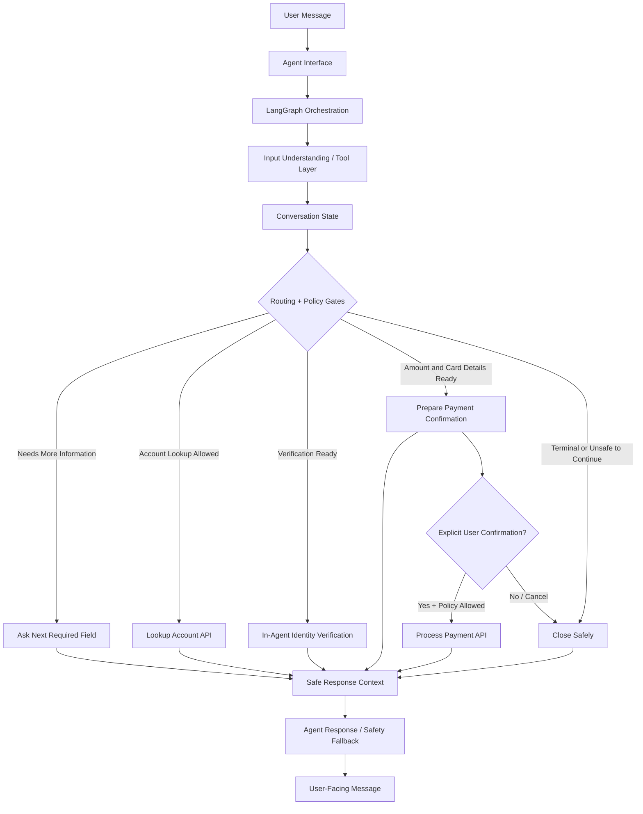

# SettleSentry: Payment Collection Agent


**SettleSentry** is a conversational payment collection agent for services where customers may have an outstanding amount due, such as cloud bills, mobile plans, subscriptions, or other recurring service balances. It verifies the customer first, shows the amount due only after verification, and guides payment collection through a controlled, policy-governed workflow.

> SettleSentry guides payment collection to closure in **under 9 user turns on average**, with **1 min 14 sec automated completion time** with full policy compliance, **0 PII leaks** and no premature payment calls.

The core design principle is separation of conversation intelligence from payment authority:

- Deterministic workflow and policy gates control verification, balance disclosure, payment confirmation, and payment execution.
- LLMs can be used progressively: for parsing, response phrasing, or autonomous tool orchestration.
- Even in autonomous mode, the LLM does not own payment authority; it can only call phase-scoped tools backed by deterministic operations and policy checks.


## Why It Matters

Payment collection is a sensitive workflow. The agent must maintain multi-turn context, avoid premature tool calls, handle partial or out-of-order input, enforce identity verification, recover safely from failures, and protect sensitive identity and payment data.

SettleSentry demonstrates how this workflow can be automated without giving uncontrolled authority to an LLM. Language models can help interpret user input and phrase responses, while verification, balance disclosure, payment authorization, and API execution remain controlled by deterministic workflow and policy logic.

## Core Capabilities

- Multi-turn account verification and payment collection
- Strict identity verification before balance disclosure
- Policy-gated amount validation, card collection, and payment execution
- Explicit confirmation before any payment API call
- Recovery flows for verification, amount, card, API, cancellation, and terminal failure cases
- Progressive LLM integration: parser, responder, and autonomous tool-calling modes with deterministic fallback boundaries
- Four-mode ablation design: deterministic workflow, LLM parser, LLM parser/responder, and LLM autonomous tool orchestration
- LLM-led autonomous mode over phase-scoped account, identity, amount, card, confirmation, lifecycle, and safety tools
- Safety audit and deterministic fallback for autonomous LLM responses
- Scenario filtering and exhaustive all-mode evaluation support
- Scenario evaluator covering success, recovery, guardrail, correction, and closure paths
- Evaluation-compatible interface

## Architecture Overview



Each user message is processed as one controlled workflow turn. The agent preserves structured state and recent context for short replies, corrections, retries, and out-of-order inputs, while deterministic policy gates control account lookup, verification, balance disclosure, confirmation, and payment execution across all modes.

For the full architecture, policy model, assumptions, and tradeoffs, see the [Design Document](docs/DESIGN.md).

## Safety Model

SettleSentry keeps payment authority outside the LLM:

* Balance is shown only after successful identity verification.
* Payment amount is validated before card collection.
* Payment processing requires valid payment details and explicit confirmation.
* All payment-critical transitions pass deterministic policy checks.
* Full card number and CVV are cleared after success, terminal failure, cancellation, or closure.
* Out-of-order user input may be remembered, but policy gates still control sensitive actions.

For detailed safety rules and workflow decisions, see [Design Document](docs/DESIGN.md).

## Modes

The CLI supports four modes:

| Mode | Input Understanding | Response Writing | Tool / Workflow Control | Use Case |
|---|---|---|---|---|
| `deterministic-workflow` | Deterministic parser | Deterministic responses | LangGraph workflow routing | Stable no-LLM baseline |
| `llm-parser-workflow` | LLM parser with deterministic fallback | Deterministic responses | LangGraph workflow routing | Flexible extraction with fixed response behavior |
| `llm-parser-responder-workflow` | LLM parser with deterministic fallback | LLM responder with deterministic fallback | LangGraph workflow routing | Natural extraction and response phrasing |
| `llm-autonomous-agent` | LLM interprets the turn | LLM-written response with safety audit/fallback | LLM tool selection over phase-scoped tools | Autonomous agent ablation mode |

The default CLI mode is `llm-parser-workflow`. Use `deterministic-workflow` when no OpenRouter API key is configured.

In every mode, payment authority remains deterministic and policy-controlled. The LLM does not verify identity, authorize balance disclosure, bypass policy gates, or process payment without explicit confirmation.

## Tech Stack

* Python 3.12
* LangGraph for workflow orchestration
* Pydantic and Pydantic Settings for schema/configuration validation
* PydanticAI with OpenRouter for optional LLM parser, responder, and autonomous tool-orchestration behavior
* HTTPX and Tenacity for API communication and retry handling
* Typer and Rich for interactive CLI
* Pytest for unit and workflow test coverage
* uv for environment and execution management

## Setup

From the repository root:

```bash
uv sync --all-packages
```

## Configuration

LLM configuration is optional and required for `llm-parser-workflow`, `llm-parser-responder-workflow`, and `llm-autonomous-agent`.

```bash
# Optional, required only for LLM modes
OPENROUTER_API_KEY=...

# Optional LLM tuning
OPENROUTER_ENABLED=true
OPENROUTER_MODEL=openrouter/free
OPENROUTER_TIMEOUT_SECONDS=10
OPENROUTER_TEMPERATURE=0.0
OPENROUTER_MAX_TOKENS=300
OPENROUTER_RETRIES=1

# Optional API configuration
API_BASE_URL=...
API_TIMEOUT_SECONDS=30
API_MAX_RETRIES=2

# Optional agent policy configuration
AGENT_POLICY_VERIFICATION_MAX_ATTEMPTS=3
AGENT_POLICY_PAYMENT_MAX_ATTEMPTS=3
AGENT_POLICY_ALLOW_PARTIAL_PAYMENTS=true
AGENT_POLICY_ALLOW_ZERO_BALANCE_PAYMENT=false
```

## Run the Agent

```bash
# Deterministic workflow
uv run settlesentry chat --mode deterministic-workflow

# LLM parser with deterministic responses
uv run settlesentry chat --mode llm-parser-workflow

# LLM parser and LLM-written responses
uv run settlesentry chat --mode llm-parser-responder-workflow

# LLM autonomous tool-calling agent
uv run settlesentry chat --mode llm-autonomous-agent

# Show privacy-safe state after each turn
uv run settlesentry chat --mode llm-autonomous-agent --show-state

# Enable console debug logs
uv run settlesentry chat --mode llm-autonomous-agent --debug-logs
```

If no OpenRouter API key is configured, use `deterministic-workflow` mode.

## Run Tests and Evaluation

Run the core test suite:

```bash
uv run pytest -q
```

Run mode-specific evaluation:

```bash
# Deterministic baseline: no LLM dependencies.
uv run python scripts/evaluate_agent.py --no-all --mode deterministic-workflow

# Hybrid mode: LLM parser with deterministic response generation.
uv run python scripts/evaluate_agent.py --no-all --mode llm-parser-workflow

# Hybrid mode: LLM parser and LLM responder (deterministic fallback remains available).
uv run python scripts/evaluate_agent.py --no-all --mode llm-parser-responder-workflow

# Autonomous mode: LLM-led, phase-scoped tool orchestration with safety/fallback controls.
uv run python scripts/evaluate_agent.py --no-all --mode llm-autonomous-agent

# Full exhaustive run: execute the complete scenario matrix across all configured modes.
uv run python scripts/evaluate_agent.py --all --exhaustive

```

Run a targeted autonomous scenario:

```bash
uv run python scripts/evaluate_agent.py --mode llm-autonomous-agent --no-all --exhaustive --scenario verification_exhaustion_closes
```

For evaluation methodology, metrics, and acceptance criteria, see [Evaluation Approach](docs/EVALUATION.md).

## Public Interface Contract

SettleSentry exposes a single turn-based interface:

```python
Agent.next(user_input: str) -> {"message": str}
```

The interface is intentionally simple for evaluation and integration, while the implementation maintains session state, policy checks, graph orchestration, parser context, and external API boundaries internally.

## Project Structure

```text
settlesentry/          # Installable package workspace
tests/                 # Unit and workflow tests
scripts/               # Scenario evaluator and helper scripts
docs/                  # Design, evaluation, and sample conversation docs
var/evaluation/        # Generated evaluation reports
```

For detailed package/module layout, see [settlesentry/README.md](settlesentry/README.md).

## Example Happy Path

```text
USER: Hi
AGENT: Hello, I'm SettleSentry. I help with account verification and payment. Please share your account ID.

USER: ACC1001
AGENT: Account found. Please share your full name exactly as registered on the account.

USER: Nithin Jain
AGENT: Please share one verification factor: DOB in YYYY-MM-DD format, Aadhaar last 4 digits, or pincode.

USER: 1990-05-14
AGENT: Identity verified. Your outstanding balance is INR 1250.75. Please share the amount you would like to pay in INR.

... payment amount, card details, and confirmation collected ...

USER: yes
AGENT: Payment of INR 500.00 was processed successfully. Transaction ID: txn_.... This conversation is now closed.
```

Full happy-path, failure, retry, side-question, correction, and closure examples are documented in [Sample Conversations](docs/SAMPLE_CONVERSATIONS.md).

## Documentation

* [Design Document](docs/DESIGN.md)
* [Evaluation Approach](docs/EVALUATION.md)
* [Sample Conversations](docs/SAMPLE_CONVERSATIONS.md)
* [Autonomous Agent Mode](docs/AUTONOMOUS_MODE.md)
* [Engineering Issue Log](docs/DEVELOPMENT_ISSUES.md)
* [Assignment Instructions](docs/instructions/ASSIGNMENT.md)
* [Package Layout](settlesentry/README.md)

## Disclaimer

SettleSentry is a technical implementation and reference architecture for a payment collection agent. It is not intended for production payment processing as-is.

A production deployment would require additional security review, PCI-DSS controls, secrets management, persistent session storage, monitoring, audit logging, human escalation, fraud controls, and compliance validation.

> [!CAUTION]
> Do not use real payment card data with this project. Use only assignment-provided or test payment data.

## License

This project is licensed under the BSD 3-Clause License. See [LICENSE](LICENSE) for details.
