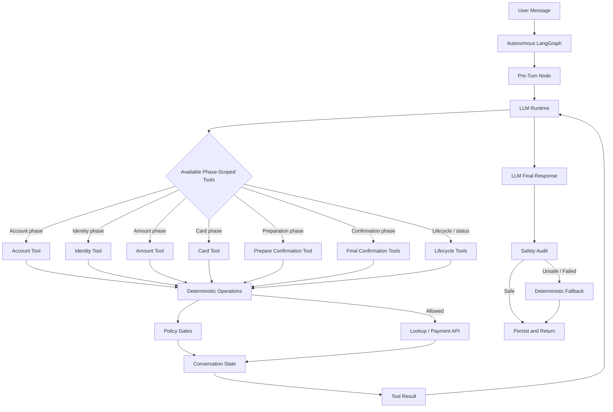

# Autonomous Agent Mode

`llm-autonomous-agent` is the 4th SettleSentry mode. It evaluates LLM-led tool orchestration while preserving deterministic payment authority.

The mode is intentionally agentic at the conversation layer, but controlled at the payment layer. The LLM can decide whether to ask the next question or call an available tool, but it cannot bypass workflow state, policy gates, identity verification, confirmation, or payment-processing rules.

## Purpose

`llm-autonomous-agent` exists as an ablation mode to test how far conversation control can be delegated to an LLM without delegating payment authority.

It demonstrates:

- LLM-led tool selection across a regulated payment flow
- phase-scoped tool access instead of unrestricted tools
- deterministic policy gates behind every payment-critical operation
- safety audit and deterministic fallback for user-facing responses
- measurable comparison against deterministic and hybrid LLM modes

## How It Differs From Modes 1-3

Modes 1-3 use parser/responder variants over a graph-routed deterministic workflow.

In mode 4, the LLM does not merely extract fields. It chooses among the currently available tools for the active workflow phase. Those tools still delegate to deterministic operations and policy checks.

## High-Level Flow



## Tool Surface

The autonomous mode exposes only the tools relevant to the current workflow phase.

### Lifecycle tools

Used for greetings, safe status checks, cancellation, and closure.

Examples:

* start payment flow
* get current status
* cancel flow

### Account tools

Used only when account lookup is pending or the customer corrects an account ID.

Rules:

* account IDs are treated as opaque identifiers
* the model must not autocorrect account IDs
* a new account ID triggers a fresh lookup
* changing account ID clears downstream identity and payment context

### Identity tools

Used during identity verification.

Rules:

* full name must be submitted through the identity tool
* DOB, Aadhaar last 4, and pincode must be submitted through the identity tool
* bare values are actionable when a secondary factor is pending:
  * `YYYY-MM-DD` -> DOB
  * 4 digits -> Aadhaar last 4
  * 6 digits -> pincode
* the model must not reveal which identity field failed
* attempts remaining must be mentioned when returned by the tool result
* verification exhaustion closes the flow without payment

### Amount tools

Used only after identity verification.

Rules:
* amount must be greater than zero
* amount cannot exceed outstanding balance
* amount must respect configured policy limits
* invalid amount blocks card collection
* corrected amount resets confirmation

### Card tools

Used only after a valid payment amount is accepted.

Rules:
* cardholder name, full card number, expiry, and CVV may be collected together
* card submission is not payment confirmation
* full card number and CVV must never be repeated in user-facing messages
* if payment processing rejects card details, the full card bundle is cleared and collected again

### Prepare confirmation tools

Used after amount and required card details are complete.

Rules:
* preparation stages the payment for confirmation
* no money movement happens during preparation
* payment readiness can be claimed only when the tool returns `payment_ready_for_confirmation`

### Final confirmation tools

Used only when explicit confirmation is pending.

Rules:

* process payment only after a clear yes/confirm/proceed
* decline and close safely on no/cancel/stop/refusal
* corrected amount during confirmation must call the amount-correction tool
* payment success can be claimed only when a transaction ID is returned

## Safety Boundaries

Autonomous mode keeps the LLM inside a constrained action space.

It does not allow:

* unrestricted tool access
* balance disclosure before verification
* card collection before valid amount
* confirmation before complete payment details
* payment processing before explicit confirmation
* direct external API calls by the LLM
* identity verification by the LLM
* payment success claims without transaction ID

Payment-critical behavior remains deterministic:

* account lookup is performed through the account operation
* identity verification is exact and policy-controlled
* amount validation is deterministic
* payment preparation and confirmation are separate
* payment API execution is isolated behind final confirmation and policy checks
* terminal closure clears sensitive payment details

## Safety Audit and Fallback

After the LLM writes the final customer-facing response, the autonomous graph audits the message before returning it.

The safety audit checks for:

* DOB leakage
* Aadhaar or pincode leakage
* full card number or CVV leakage
* false identity verification claims
* balance disclosure before verification
* false payment success claims
* vague terminal closure after verification exhaustion
* weak payment-retry explanations

If the response is unsafe, incomplete, or the LLM runtime fails, the graph routes to deterministic fallback response generation.

Fallback is a safety net, not the primary control path. The expected normal path is:

```text
LLM selects tool -> deterministic operation returns tool result -> LLM writes response -> safety audit passes
```

## Logging and Observability

Autonomous mode logs key safety and fallback events:

* `autonomous_turn_failed`
* `autonomous_safety_audit_failed`
* `autonomous_fallback_response_used`

Fallback logs include status, step, error status, safety audit status, and required fields. This makes it easier to distinguish normal LLM-led responses from deterministic safety fallback.

## Known Tradeoffs

Autonomous mode is slower and more stochastic than deterministic modes because each turn may require LLM reasoning, tool selection, and response generation.

The tradeoff is intentional. This mode is used to evaluate whether an LLM can safely orchestrate a regulated workflow when:

* tool access is phase-scoped
* deterministic policy gates remain authoritative
* final responses are audited
* fallback remains available for unsafe or failed generations


## When To Use This Mode

Use `llm-autonomous-agent` when you want to test or demonstrate:

* LLM-led tool orchestration
* agentic recovery behavior
* phase-scoped tool access
* policy-gated action execution
* safety audit and fallback around LLM-written responses

Use deterministic or hybrid modes when you need:

* fastest execution
* lower cost
* minimum stochastic behavior
* stable baseline regression testing
