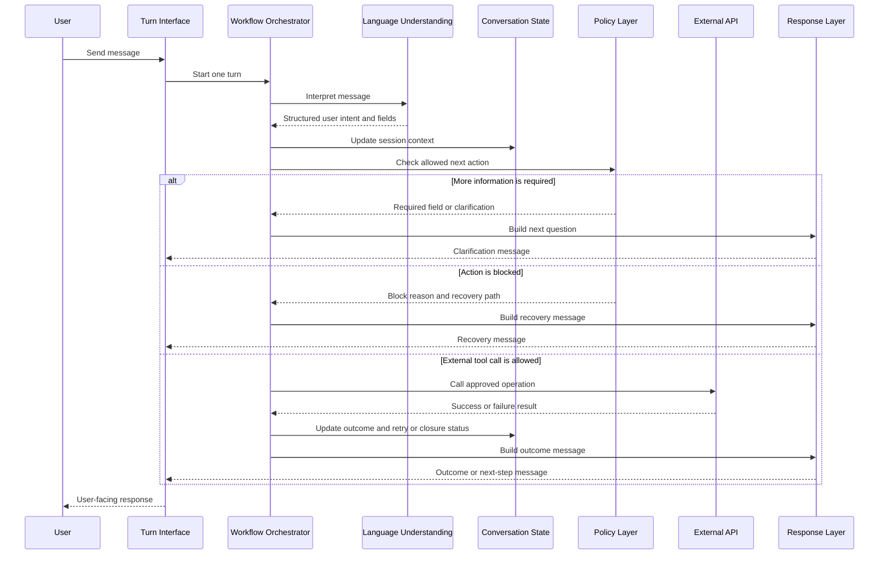

# SettleSentry Design Document

## 1. Purpose

SettleSentry is a production-oriented payment collection agent for controlled conversational payment workflows.

It handles account lookup, strict identity verification, balance disclosure, payment detail collection, payment processing, and safe conversation closure.

The goal is not open-ended chat. The goal is safe, auditable, policy-governed execution with clear recovery behavior across multi-turn conversations.

## 2. Problem Being Solved

Payment collection conversations are operationally and compliance-sensitive. The agent must:

- maintain context across multiple user turns,
- handle partial and out-of-order user input,
- verify identity before disclosing balance,
- avoid premature or unsafe API calls,
- validate payment details before processing,
- distinguish recoverable failures from terminal failures,
- protect sensitive identity and payment data,
- and communicate outcomes clearly.

A generic chatbot is not sufficient for this workflow because payment collection requires deterministic control over state, verification, tool calls, and failure handling.

SettleSentry addresses this through layered control:

- language understanding,
- conversation state tracking,
- deterministic policy checks,
- graph-based workflow orchestration,
- typed external API integration,
- and safe response generation.

## 3. System Architecture

```mermaid
flowchart TD
    U[User Message] --> I[Turn-Based Agent Interface]
    I --> G[Workflow Orchestrator]

    G --> P[Language Understanding Layer]
    P --> S[Conversation State]
    S --> R{Routing and Policy Layer}

    R -->|Account Lookup Allowed| L[Account Lookup Integration]
    R -->|Verification Ready| V[Identity Verification]
    R -->|Payment Details Ready| C[Payment Preparation]
    R -->|Confirmation Present| X[Payment Processing]
    R -->|More Input Needed| Q[Clarification or Recovery Prompt]
    R -->|Conversation Complete| Z[Recap and Closure]

    L --> M[Response Generation]
    V --> M
    C --> M
    X --> M
    Q --> M
    Z --> M

    M --> A[User-Facing Message]
````

The workflow is graph-orchestrated and runs once per user turn. The conversation remains multi-turn because the same session keeps account, verification, payment, retry, and closure state across turns.

## 4. Major Components

### Turn-Based Interface

The agent exposes a simple turn-based interface: one user message in, one structured user-facing message out.

This keeps the system easy to evaluate and easy to integrate into chat surfaces, while the agent internally maintains conversation state across turns.

### Conversation State Management

The state layer tracks:

* account progress,
* verification progress,
* payment detail progress,
* confirmation status,
* retry counters,
* payment outcome,
* and closure status.

State enables the agent to handle out-of-order input without skipping required safety steps.

Sensitive data is kept out of user-facing responses unless it is explicitly safe to show. For example, outstanding balance is disclosed only after successful identity verification.

### Workflow Orchestration

The workflow orchestrator controls progression across the payment collection lifecycle:

* user input handling,
* account lookup,
* identity verification,
* payment preparation,
* confirmation,
* payment processing,
* recap and closure,
* and response generation.

The workflow advances only when the current step explicitly allows the next step. If a policy check blocks progress or more user input is needed, the agent routes to a response step instead of continuing blindly.

This makes the workflow predictable, testable, and safer than a free-form LLM-driven flow.

### Policy Layer

The policy layer is the hard safety boundary.

It decides whether a workflow action is allowed before any sensitive operation happens. Policy checks cover:

* whether the conversation is still open,
* whether account lookup has succeeded,
* whether identity has been verified,
* whether retry limits remain available,
* whether payment amount is valid,
* whether amount is within the account balance,
* whether payment details are complete,
* whether explicit confirmation is present,
* and whether payment processing is allowed.

The LLM cannot override these checks.

### Language Understanding Layer

The language understanding layer extracts useful structure from user messages, such as account identifiers, names, verification factors, payment amounts, card details, confirmations, corrections, cancellations, and side questions.

This layer can be deterministic or LLM-assisted. In both cases, extracted information is treated as user-provided input, not as authorization.

### Response Layer

The response layer generates safe user-facing messages from the current workflow status, required fields, and safe facts.

It can use deterministic messages or LLM-assisted phrasing. Safety-critical responses and provider failures fall back to deterministic response generation.

The response layer does not mutate state, call tools, verify identity, authorize payment, or expose sensitive raw values.

### External Integrations

The system integrates with two external API operations:

* account lookup,
* payment processing.

Identity verification remains inside the agent. The external payment API is used only after the agent has completed verification, collected valid payment details, and received explicit confirmation.

## 5. Policy and Decision Flow

```mermaid
flowchart TD
    A[User Turn Arrives] --> B[Understand Message and Update State]
    B --> C{What Does the Workflow Need Next?}

    C -->|Account Lookup Needed| D{Lookup Allowed?}
    D -->|No| D1[Ask for Account Information]
    D -->|Yes| D2[Call Account Lookup]

    C -->|Verification Needed| E{Verification Inputs Ready?}
    E -->|No| E1[Ask for Required Verification Input]
    E -->|Yes| E2[Verify Identity]

    E2 -->|Failed, Attempts Left| E3[Ask for Retry]
    E2 -->|Failed, Attempts Exhausted| E4[Close Safely]
    E2 -->|Passed| E5[Reveal Balance and Ask for Payment Amount]

    C -->|Payment Amount Provided| F{Amount Valid?}
    F -->|No| F1[Ask for Valid Amount]
    F -->|Yes| F2[Collect Payment Details]

    C -->|Payment Details Provided| G{Payment Ready for Confirmation?}
    G -->|No| G1[Ask for Missing or Corrected Details]
    G -->|Yes| G2[Ask for Explicit Confirmation]

    C -->|Confirmation Received| H{Payment Processing Allowed?}
    H -->|No| H1[Block Payment and Explain Next Step]
    H -->|Yes| H2[Call Payment API]

    H2 --> I{Payment Outcome}
    I -->|Success| I1[Return Transaction ID and Close]
    I -->|Recoverable Failure| I2[Ask for Targeted Retry]
    I -->|Terminal or Ambiguous Failure| I3[Close Safely]
```

## 6. Generic Turn Sequence

This sequence describes how any user turn is processed. It is not limited to the happy path.



## 7. Assumptions

The implementation makes the following assumptions:

* One agent session represents one user conversation.
* Each user message is processed as one turn.
* Conversation state is maintained for the lifetime of the session.
* Identity verification is performed inside the agent after account lookup.
* Full name matching is strict and exact.
* At least one secondary factor must match exactly: DOB, Aadhaar last 4, or pincode.
* Verification data such as DOB, Aadhaar, and pincode is not echoed back to the user.
* Outstanding balance is safe to show only after successful identity verification.
* Partial payments are allowed by default, matching the provided API behavior.
* Zero-balance accounts are closed without collecting payment unless policy configuration changes.
* The payment API validates card format, CVV, expiry, and balance, but not identity.
* The payment API does not persist balance updates after a successful payment.
* Terminal service failures are closed safely to avoid ambiguous payment retries.
* Raw card number and CVV are cleared after success, terminal failure, cancellation, or closure.
* LLM behavior is optional and must not be required for deterministic local execution.

## 8. Key Design Decisions

### LLM is bounded, not authoritative

The LLM can help interpret natural language and phrase replies, but it cannot:

* verify identity,
* approve balance disclosure,
* authorize payment,
* bypass policy gates,
* or directly execute payment API calls.

This keeps payment authority in deterministic workflow and policy logic rather than model output.

### Verification is deterministic and strict

Identity verification requires:

* exact full-name match,
* plus one exact secondary-factor match.

This avoids fuzzy matching risks in a sensitive financial workflow.

### Workflow progression is graph-controlled

The workflow is represented as explicit stages with guarded transitions.

This makes the agent easier to reason about, test, debug, and extend. It also avoids giving the LLM direct control over payment-critical actions.

### Payment preparation is separated from execution

Payment preparation validates collected details and asks for explicit confirmation.

Payment execution is isolated and only runs after the final policy gate passes.

### Terminal failures close safely

Network errors, timeouts, invalid responses, and unexpected service failures can create ambiguous payment status. The system closes safely instead of retrying automatically and risking duplicate or unsafe payment attempts.

### Responses are generated from safe context

User-facing responses are generated from safe workflow context only. Sensitive verification data, full card number, CVV, raw account details, and internal policy/tool information are not exposed.

## 9. Business Implications

The design supports safer payment collection automation by improving:

* consistency in payment collection handling,
* customer guidance during recoverable errors,
* protection against unsafe workflow shortcuts,
* auditability through explicit workflow and policy boundaries,
* operational efficiency for repetitive payment workflows,
* extensibility for future tool-calling and human-handoff scenarios.

The main business value is not simply automating chat. It is automating the workflow while preserving control over identity verification, balance disclosure, payment authorization, and failure recovery.

## 10. Tradeoffs

### More structured than a free-form assistant

The agent intentionally guides the user step by step. This can feel less flexible than open-ended chat, but it improves reliability and safety.

### Deterministic policy gates reduce conversational freedom

The LLM cannot override policy checks. This limits flexibility but prevents unsafe actions.

### Graph orchestration adds implementation complexity

A graph-based workflow is more structured than a simple procedural loop. The tradeoff is clearer workflow boundaries, better testability, and easier extension toward graph-native tool calling.

### In-memory state is sufficient for this implementation

The current design keeps state within one active session. A production deployment would likely persist session state externally for durability, recovery, and horizontal scaling.

## 11. Future Improvements

Future improvements could include:

* graph-native tool-calling where the LLM proposes actions and the workflow/policy layer validates them,
* broader adversarial and simulation-based evaluation suites,
* persistent session storage,
* observability dashboards for workflow transitions and policy blocks,
* human handoff thresholds for repeated failures,
* stronger audit logs and redaction controls,
* configurable business policies by account or client segment,
* expanded localization and multilingual flow handling,
* PCI-DSS aligned tokenization or payment-provider handoff for real card data.