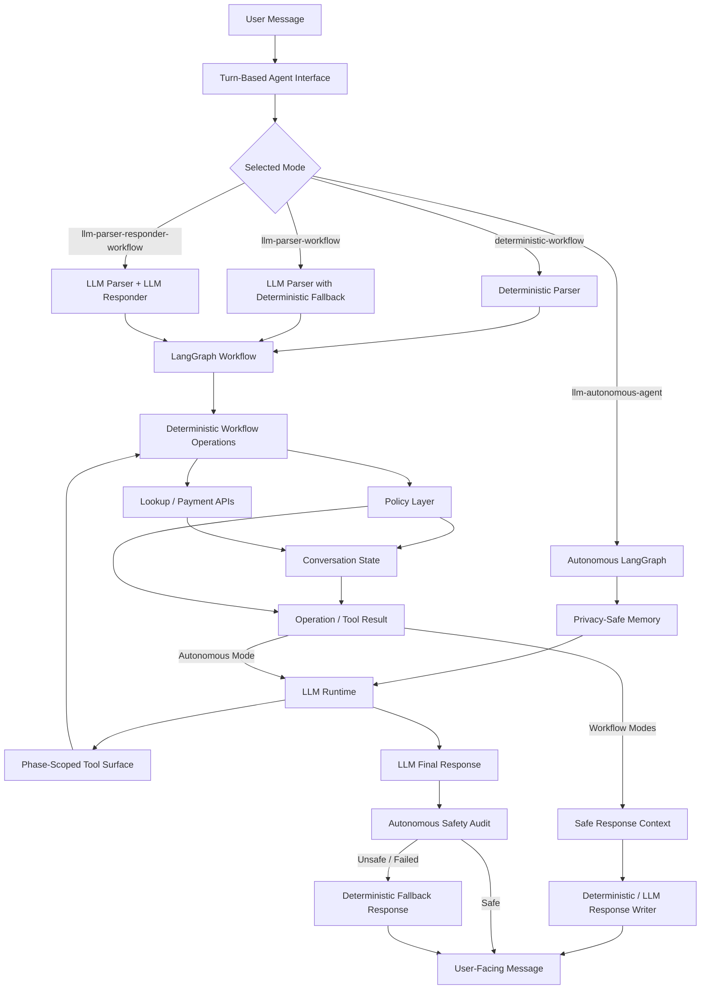
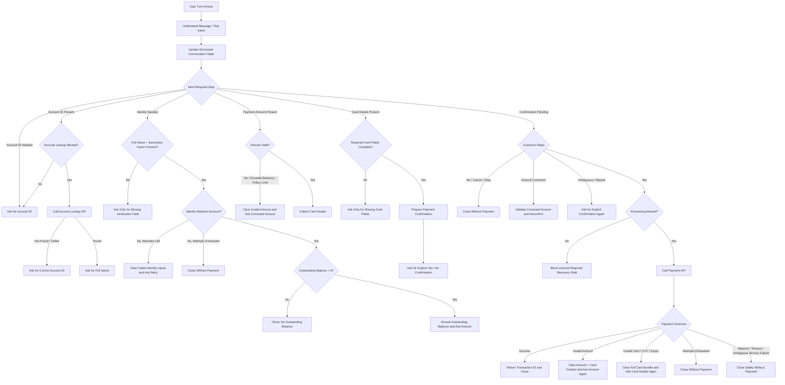
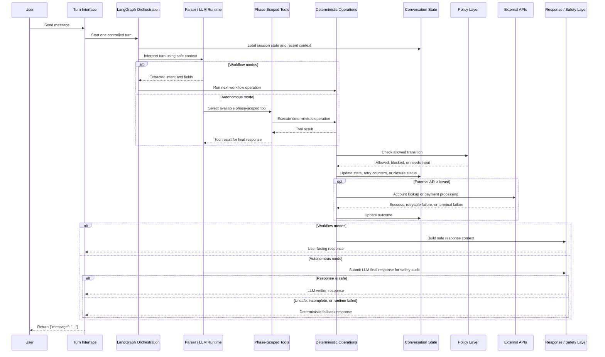

# SettleSentry Design Document

## 1. Purpose

SettleSentry is a payment collection agent for controlled conversational workflows where a customer may need to verify their account, review an outstanding amount due, and complete a payment.

The design goal is safe, auditable execution rather than open-ended chat. Language understanding and conversation orchestration can be assisted by an LLM depending on the selected mode, but payment authority stays with deterministic workflow operations, structured state, and policy controls.

The agent handles:

- account lookup
- strict identity verification
- balance disclosure after verification
- payment amount and card detail collection
- explicit payment confirmation
- payment API execution
- retry, recovery, cancellation, and safe closure

## 2. Problem Being Solved

Payment collection conversations are operationally and compliance-sensitive. The agent must:

- maintain context across multiple user turns
- handle partial and out-of-order user input
- verify identity before disclosing the amount due
- avoid premature or unsafe API calls
- validate payment details before processing
- distinguish recoverable failures from terminal or ambiguous failures
- protect sensitive identity and payment data
- communicate next steps and outcomes clearly

A generic chatbot is not sufficient for this workflow because payment collection requires deterministic control over state, verification, tool calls, and failure handling.

SettleSentry addresses this through layered control:

- language understanding for parsing user input
- structured session state for workflow memory
- deterministic policy checks for payment-critical decisions
- LangGraph orchestration for explicit workflow progression
- typed external API integration for lookup and payment calls
- safe response generation from approved context

## 3. System Architecture

This diagram shows the component-level architecture. Detailed business routing decisions, retry handling, closure paths, and payment failure handling are shown separately in the policy and decision-flow diagram below.

The workflow is graph-orchestrated and runs once per user turn. The same session preserves structured workflow state and recent conversation context, so the agent can handle short replies, corrections, retries, and out-of-order inputs without giving the LLM authority over payment-critical decisions.

About different modes:
- Modes 1-3 use a graph-routed workflow where parser and responder behavior vary by mode. 
- Mode 4 uses an autonomous LLM tool-calling graph: the LLM chooses among phase-scoped tools, but each tool delegates to the same deterministic operations and policy gates.

## 4. Component Responsibilities

### Turn-Based Interface

The public interface is intentionally small:

- `Agent.next(user_input: str) -> dict`
- return shape is exactly `{"message": str}`
- each call processes one workflow turn for the active session

This keeps the agent easy to evaluate, test, and integrate into chat surfaces. Internal workflow, policy, parser, and response changes must preserve this interface contract.

### Conversation State

The state layer tracks the authoritative workflow facts for one active session:

- account progress
- identity verification progress
- payment amount
- card detail completion
- confirmation status
- verification and payment retry counters
- payment outcome
- closure status

State enables the agent to remember information already provided while still enforcing the required controls before sensitive actions.

Recent user/assistant turns are retained only for parser context. This helps LLM-assisted parsing interpret short replies and corrections, but conversation history is not treated as payment authority. Structured state and policy gates remain authoritative.

Sensitive values are kept out of safe response context unless explicitly allowed. For example, outstanding balance is disclosed only after successful identity verification.

### Workflow Orchestration

The workflow orchestrator controls progression across the payment collection lifecycle:

- input ingestion
- account lookup
- identity verification
- payment preparation
- confirmation
- payment processing
- recovery or closure
- response generation

The workflow advances only when the current state and policy checks allow the next operation. If more information is needed or an action is blocked, the graph routes to response generation instead of continuing blindly.

This makes the workflow predictable, testable, and safer than a free-form LLM-driven flow.

### Autonomous Tool-Orchestration Mode

The fourth mode, `llm-autonomous-agent`, uses an LLM to decide whether to ask the next question or call one of the currently available tools. This mode is agentic at the conversation layer but bounded at the payment layer.

The LLM receives a privacy-safe memory payload containing the latest user message, safe state, required fields, and redacted recent turns. It can only access toolsets exposed for the current workflow phase:

- lifecycle tools for start, status, cancellation, and closure
- account tools for account ID lookup
- identity tools for full name and secondary-factor verification
- amount tools for payment amount validation
- card tools for card-detail capture
- preparation tools for staging explicit confirmation
- final confirmation tools for confirm/process, decline, and amount correction

The tool surface is phase-scoped so the model cannot call payment-processing tools before account lookup, identity verification, amount validation, card collection, and explicit confirmation. Each tool delegates to deterministic workflow operations and policy gates.

After the LLM writes a final response, the autonomous graph runs a safety audit. Unsafe, vague, or failed responses fall back to deterministic response generation.

For package and module layout, see [settlesentry/README.md](../settlesentry/README.md).

### Policy Layer

The policy layer is the hard safety boundary.

It decides whether a workflow action is allowed before any sensitive operation happens. Policy checks cover:

- whether the conversation is still open
- whether account lookup has succeeded
- whether identity has been verified
- whether retry limits remain available
- whether payment amount is valid
- whether amount is within the outstanding balance
- whether payment details are complete
- whether explicit confirmation is present
- whether payment processing is allowed

The LLM cannot override these checks.

### Language Understanding Layer

The language understanding layer extracts structure from user messages, such as account identifiers, names, verification factors, payment amounts, card details, confirmations, corrections, cancellations, and side questions.

This layer can be deterministic or LLM-assisted. In both cases, extracted information is treated as user-provided input, not as authorization.

The parser may extract multiple fields from one message, especially in LLM-assisted modes. Extracted fields can be remembered, but workflow and policy gates decide when account lookup, identity verification, balance disclosure, payment preparation, confirmation, and payment processing may occur.

Recent conversation turns and the last assistant message are provided to the parser as context. Only structured extracted fields are merged into workflow state.

### Response Layer

The response layer generates user-facing messages from workflow status, required fields, safe facts, and safe state.

It can use deterministic messages or LLM-assisted phrasing. Safety-critical responses and provider failures fall back to deterministic response generation.

The response layer does not mutate state, call tools, verify identity, authorize payment, or expose sensitive raw values.

### External Integrations

The system integrates with two external API operations:

- account lookup
- payment processing

Identity verification remains inside the agent. The payment API is called only after verification, valid payment details, and explicit confirmation.

## 5. Policy and Decision Flow

## 6. Generic Turn Sequence

This sequence describes how any user turn is processed. It is not limited to the happy path.

## 7. Assumptions

The implementation makes the following assumptions:

- One agent session represents one user conversation.
- Each user message is processed as one turn.
- Structured conversation state is maintained for the lifetime of the session.
- Recent conversation turns may be retained for parser context during the active session.
- Conversation history is not used as payment authority; structured state and policy gates remain authoritative.
- Identity verification is performed inside the agent after account lookup.
- Full name matching is strict and exact.
- At least one secondary factor must match exactly: DOB, Aadhaar last 4, or pincode.
- Verification data such as DOB, Aadhaar, and pincode is not echoed back to the user.
- Outstanding balance is safe to show only after successful identity verification.
- The account balance represents an outstanding payable amount for the customer account.
- Card details are collected only as the payment method for that outstanding balance.
- This implementation does not assume the account itself is a credit card account.
- Partial payments are allowed by default, matching the provided API behavior.
- Zero-balance accounts are closed without collecting payment unless policy configuration changes.
- Local schemas validate payment amount and card structure before payment processing.
- The payment API may still reject card, CVV, expiry, amount, balance, or service-level failures.
- The payment API does not persist balance updates after a successful payment.
- Terminal service failures close safely to avoid ambiguous payment retries.
- Cardholder name, full card number, expiry, and CVV are cleared after success, terminal failure, cancellation, or closure.
- LLM behavior is optional and must not be required for deterministic local execution.

## 8. Key Design Decisions

### LLM is bounded, not authoritative

The LLM can help interpret natural language, phrase replies, and in autonomous mode request tool calls. It cannot:

- verify identity by itself
- approve balance disclosure
- authorize payment outside policy gates
- bypass required workflow state
- directly call external APIs
- process payment unless the final confirmation tool and deterministic policy checks allow it

This keeps payment authority in deterministic workflow and policy logic rather than model output.

### Verification is deterministic and strict

Identity verification requires:

- exact full-name match
- one exact secondary-factor match

This avoids fuzzy matching risks in a sensitive payment workflow.

### Workflow progression is graph-controlled

The workflow is represented as explicit stages with guarded transitions.

This makes the agent easier to reason about, test, debug, and extend. It also avoids giving the LLM direct control over payment-critical actions.

### Payment preparation is separated from execution

Payment preparation validates collected details and asks for explicit confirmation.

Payment execution is isolated and only runs after the final policy gate passes.

### Terminal failures close safely

Network errors, timeouts, invalid responses, and unexpected service failures can create ambiguous payment status.

The system closes safely instead of retrying automatically and risking duplicate or unsafe payment attempts.

### Responses are generated from safe context

User-facing responses are generated from safe workflow context only.

Sensitive verification data, full card number, CVV, raw account details, and internal policy/tool information are not exposed.

## 9. Tradeoffs

### More structured than a free-form assistant

The agent intentionally guides the user through a controlled flow. This can feel less flexible than open-ended chat, but it improves reliability, safety, and auditability.

### Deterministic policy gates reduce conversational freedom

The LLM cannot override policy checks. This limits flexibility but prevents unsafe actions.

### Graph orchestration adds implementation complexity

A graph-based workflow is more structured than a procedural loop. The tradeoff is clearer workflow boundaries, better testability, and clearer separation between deterministic workflow modes and the autonomous tool-calling mode.

### In-memory state is sufficient for this implementation

The current implementation keeps state within one active session. A production deployment would likely persist session state externally for durability, recovery, and horizontal scaling.

### Full card handling is for assignment simulation only

The implementation accepts test card details to exercise the payment workflow. A production system should use a PCI-DSS aligned payment-provider handoff or tokenization flow instead of directly handling raw card data.

## 10. Future Improvements

Future improvements could include:

- broader adversarial evaluation for autonomous tool selection
- persistent session storage and checkpointing
- observability dashboards for tool calls, safety fallback, and policy blocks
- human handoff thresholds for repeated verification or payment failures
- configurable business policies by account or client segment
- expanded localization and multilingual flow handling
- PCI-DSS aligned tokenization or payment-provider handoff for real card data
